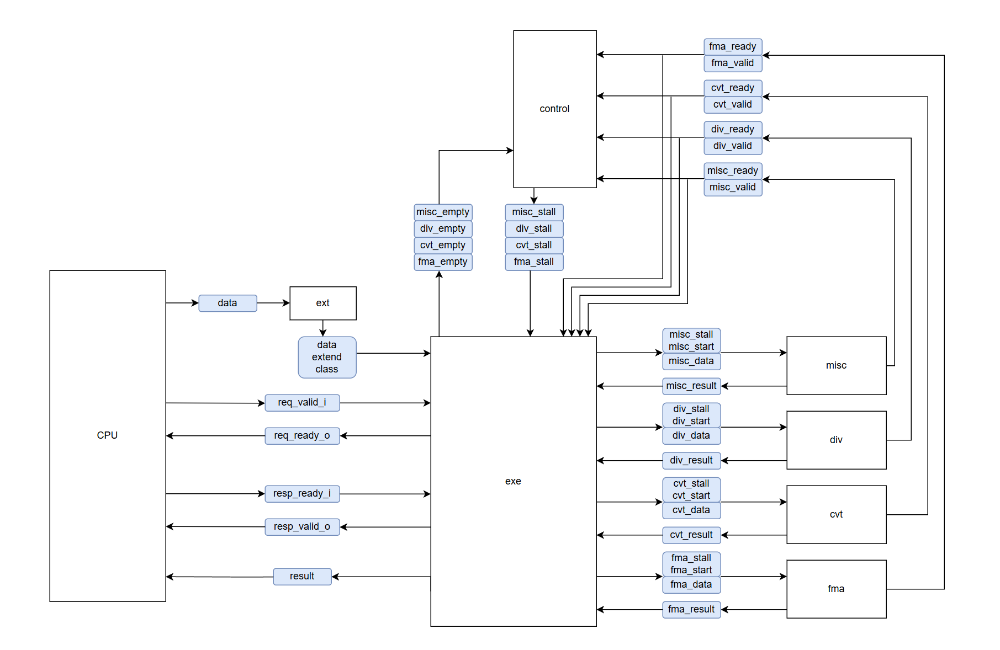

# Floating-Point Unit (FPU) Hardware Architecture

This project implements a high-performance, modular, 32-bit Floating-Point Unit (FPU) written in SystemVerilog. The FPU is designed with parallel pipeline execution and supports standard IEEE 754 floating-point operations. It features a robust Valid/Ready handshake protocol, a comprehensive pipeline stall (backpressure) mechanism, and hardware-level support for subnormal numbers.

## Architecture Diagram

## Core Design Philosophy & Features

### 1. Standard Handshake & Backpressure Protocol
The communication between the FPU and the host CPU utilizes a standard `Valid/Ready` protocol:
* **Input (Request):** The CPU asserts `req_valid_i` to dispatch an instruction, and the FPU asserts `req_ready_o` when it is ready to accept new data.
* **Output (Response):** Once computation is complete, the FPU asserts `resp_valid_o`. The CPU asserts `resp_ready_i` when it is ready to capture the result.
* **Stall Mechanism:** Governed by the `Control` module, the FPU dynamically monitors the `empty` and `busy` states of all internal registers. If the downstream CPU is not ready (`resp_ready_i == 0`), the control unit issues localized `stall` signals to prevent internal data from being overwritten, ensuring zero data loss.

### 2. EXT Preprocessing & Subnormal Handling
Before routing to the arithmetic modules, incoming 32-bit floating-point operands are unpacked by the **`EXT` (Extension) module**.
* **33-bit Expansion:** The operands are expanded into a 33-bit internal format by adding 1 extra exponent bit.
* **Subnormal Support:** This expansion seamlessly normalizes subnormal numbers by shifting the implicit leading bit. Consequently, downstream modules (FMA, DIV) do not require complex edge-case logic to handle subnormals, significantly optimizing timing and area.
* The EXT module also generates classification flags (`class`) to quickly identify special values like NaN, Infinity, and Zero.

### 3. Parallel Pipeline Execution Units
The computational core is partitioned into four independent, parallel execution units. The `EXE` dispatch module routes operands to the appropriate unit based on the decoded `op` field:

* **FMA (Fused Multiply-Add):** The primary arithmetic engine. Utilizing a 128-bit Leading Zero Counter (LZC) for high-precision intermediate calculations, it executes:
  * Standard arithmetic: `fadd`, `fsub`, `fmul`
  * Fused operations: `fmadd` (add), `fmsub` (subtract), `fnmadd` (negated add), `fnmsub` (negated subtract).
* **DIV (Division & Sqrt):** A multi-cycle iterative unit responsible for `fdiv` and `fsqrt`. It utilizes a Multiply-Accumulate (`fpu_mac`) helper block and manages an internal `div_busy` flag to halt new dispatches until the iteration completes.
* **CVT (Convert):** Handles format conversions using 32-bit LZCs to shift and normalize integers into floats (`fcvt_i2f`), and floats back to integers (`fcvt_f2i`).
* **MISC (Miscellaneous):** A fast, single-cycle unit processing sign-injections (`fsgnj`), floating-point comparisons (`fcmp`), min/max selections (`fmin`/`fmax`), and floating-point classifications (`fclass`).

### 4. Smart Output Arbitration & Priority
Because the internal execution units possess varying latencies (e.g., MISC is single-cycle, DIV is multi-cycle), multiple units may finish their computations in the exact same clock cycle.
* The `EXE` module implements a **fixed-priority arbiter**.
* In the event of a collision, output is prioritized as follows: **`MISC > DIV > CVT > FMA`**.
* Lower-priority units that lose the arbitration are safely held back via stall signals from the `Control` module until the data bus is free.

### 5. Dedicated IEEE 754 Rounding
To ensure strict IEEE 754 compliance, dedicated rounding hardware blocks (`fpu_rnd`) are attached to the outputs of the FMA, DIV, and CVT units. These guarantee accurate rounding modes before the final 32-bit result is packed and committed.

## File Structure

* **`fpu_top.sv`**: The top-level wrapper instantiating all sub-modules and exposing the main I/O bus.
* **`fpu_ext.sv`**: Data extension logic (32 to 33-bit conversion) and IEEE classification.
* **`fpu_exe.sv`**: The central dispatcher and output arbiter. Generates `start` triggers and resolves output collisions.
* **`fpu_control.sv`**: The global state machine managing backpressure, stalling logic, and the `div_busy` synchronization.
* **`fpu_fma.sv` / `fpu_div.sv` / `fpu_cvt.sv` / `fpu_misc.sv`**: The specific arithmetic and logic execution pipelines.
* **`fpu_rnd.sv`**: Standalone IEEE rounding instances.
* **`lzc_32.sv` / `lzc_128.sv`**: Leading Zero Counters used for mantissa normalization and alignment.